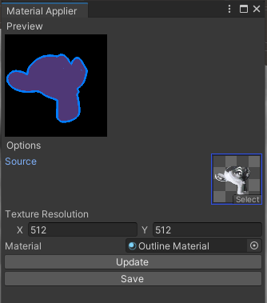

# IconMaker

----------

Tested with HDRP and URP in Unity 2022.3.0, though it should work with any version

## Installation
- Clone the repository into your project

OR

- Download the Unity Package from the Releases tab (may not be up to date)

## Setup
### Scene
- (HDRP) Choose fitting volume & settings
- See sample scene for an example
### Render Texture
- Create the render texture with a power of two size (recommended: 512)
- Set the Color Format to R8G8B8A8_SRGB (SRGB colour texture)
- You can also set the depth and stencil format to None
### Camera
- Choose an fov you prefer - currently not tested with orthographic cameras
- Position the camera towards your desired object - Fit to Target can help

## Component Usage
1. Attach the `IconMaker` component to an object
2. Assign the Camera and RenderTexture in the inspector - target object is optional (used for 'Fit to Target')
3. Specify the output directory and name
4. Press Render

## Material Applier (Icon Post-Processor)

1. There is an additional tool in Window > Material Applier
2. It will render a material (with an optional texture input) and output the result
3. See the sample (shown in the image above) for possible uses for icons
4. You can also use it to, say, render noise to textures, or anything else you can think of

  

----------

Sample HDRI from [HDRI Haven](https://hdri-haven.com/hdri/black-and-white-photo-studio)