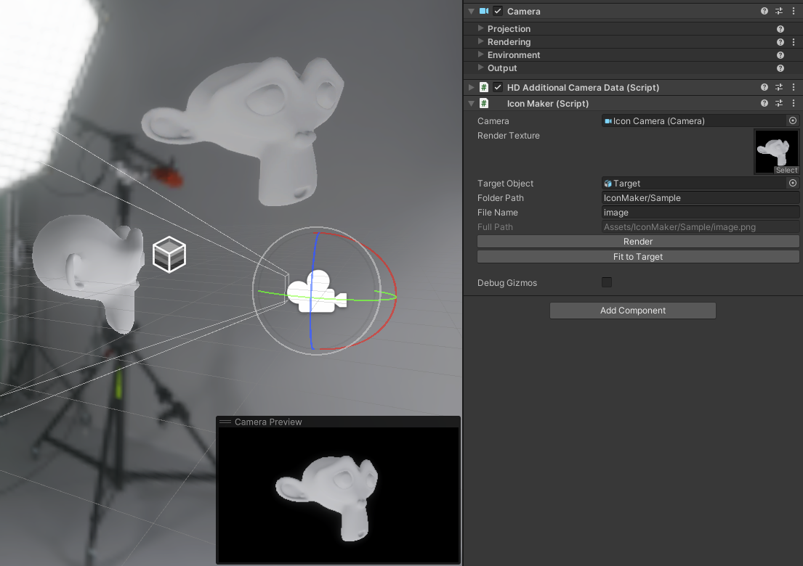

# IconMaker

Created with HDRP in Unity 2022.3.0, though it should work with any version

## Setup
### Scene
- (HDRP) Choose fitting volume & settings
- See sample scene for an example
### Render Texture
- Create the render texture with a power of two size (recommended: 512)
- Set the Color Format to R8G8B8A8_SRGB (SRGB colour texture)
- You can also set the depth and stencil format to None
### Camera
- Choose an fov you prefer - currently not tested with orthographic cameras
- Position the camera towards your desired object - auto positioning can help

## Component Usage
1. Attach the `IconMaker` component to an object
2. Assign the Camera and RenderTexture in the inspector - assigning the target object is optional
3. Specify the output directory and name
4. Press Render

----------

  

----------

Sample HDRI from [HDRI Haven](https://hdri-haven.com/hdri/black-and-white-photo-studio)